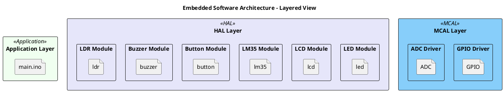
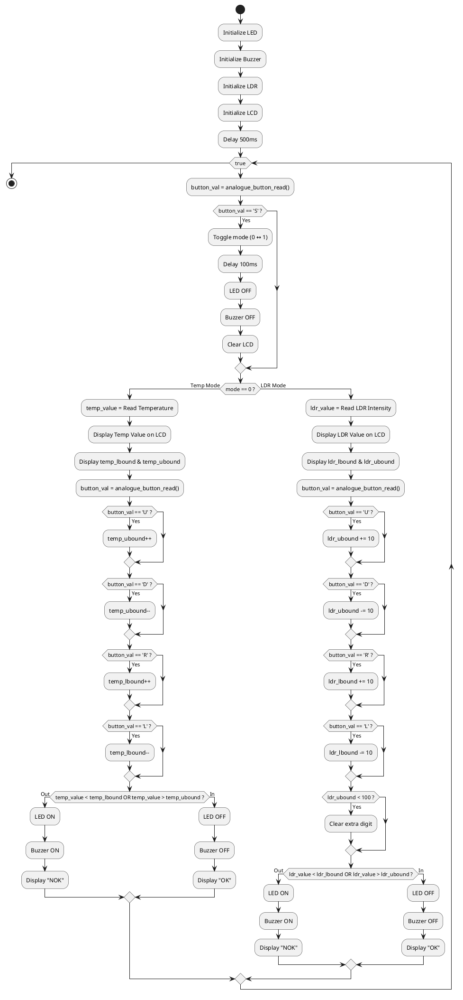
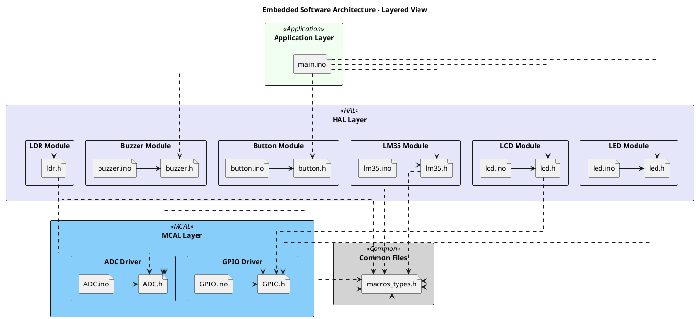

# Detailed Design Document

| **Author**              | Hamza Abbas   -   Fahd Mohamed   -   Omar Yousef     |
|:------------------------|:-----------------------------------------------------|
| **Status**              | `Approved`                                           |
| **Version**             | `1.0`                                                |
| **Date**                | `16/11/2025`                                         |

## Introduction

This report details the design, development, and implementation of an embedded Human Machine Interface (HMI) for real-time environmental monitoring. The system is built upon the AVR ATmega328P microcontroller and programmed in native C, adhering to a modular, driver-based software architecture.

The primary objective of this project, is to create a robust interface that bridges the gap between digital sensors and a human operator. The system provides a practical and interactive solution for monitoring critical environmental parameters, similar to an in-vehicle display or an industrial control panel.

The core functionality is twofold, allowing the user to switch between two distinct monitoring modes:
1.	Temperature Monitoring: Utilizes an LM35 analogue temperature sensor to provide real-time temperature readings.
2.	Light Intensity Monitoring: Employs a Light Dependent Resistor (LDR) to measure ambient light levels.

A key feature of this HMI is its user-configurable alert system. An operator can use an analogue button interface to dynamically set upper and lower threshold limits (High Limit and Low Limit) for both temperature and light intensity.

The system continuously compares the live sensor data against these user-defined bounds. This data, along with the current limits, is clearly presented on a 16x2 LCD. If a sensor reading moves outside its specified safe operating range, the system immediately activates both a visual alert (via an LED) and an audible alarm (via a buzzer).

This document will cover the complete system architecture, the layered software design including all peripheral drivers (GPIO, ADC, LCD), the hardware implementation, and the testing procedures used to validate the system's functionality and reliability.

### Purpose

The purpose of this project is to design, develop, and implement a modular and reliable embedded Human Machine Interface (HMI) for real-time environmental monitoring. This system serves both a critical academic and a practical, technical objective.

The primary academic purpose is to satisfy the requirements of Element 2: Human Machine Interface. This involves demonstrating a comprehensive, systems-engineering approach to developing and testing a complete embedded system (Learning Outcome 2) using native C programming and a modular, driver-based architecture (Learning Outcome 1).

The core technical purpose is to engineer a functional and interactive monitoring device that solves the need for continuous, localised environmental awareness and alerting. The system is designed to simulate a real-world industrial application, such as an automotive dashboard display or an industrial control panel, where operator-defined parameters are critical.

To achieve this, the project meets the following key objectives:

To Acquire and Display Data: To interface with multiple analogue sensors (LM35 for temperature, LDR for light) and accurately translate their raw data into a human-readable format on a 16x2 LCD.

To Enable User Interaction: To empower an operator to dynamically configure the system by setting custom upper (High Limit) and lower (Low Limit) thresholds for each sensor using a simple button interface.

To Provide Real-Time Alerting: To create an active safety and monitoring loop. The system continuously compares live sensor readings against the user-defined limits and provides immediate, unambiguous feedback (an "OK" or "NOK" status) along with visual (LED) and audible (buzzer) alarms if conditions fall outside the specified safe operating range.

In summary, the purpose of this HINT is to create a complete, self-contained embedded system that not only reports data but also intelligently acts upon it based on user-defined rules, bridging the gap between raw sensor data and effective human oversight.

### Scope

This section defines the functional boundaries of the Human Machine Interface (HMI) project. It outlines the features and capabilities that are included in the final system ("In Scope") as well as the limitations and features intentionally excluded ("Out of Scope").

In Scope

The project's scope is focused on delivering a complete, standalone monitoring and alerting system. All functionalities are implemented in native C for the AVR ATmega328P microcontroller.

Hardware Abstraction Layer (Drivers):

Development of low-level, modular drivers from scratch for core peripherals, including GPIO (General Purpose Input/Output), ADC (Analogue-to-Digital Converter), and a 4-bit mode 16x2 LCD.

Creation of specific drivers for output devices (LED, Buzzer) and input sensors (LM35, LDR, Buttons).

Sensor Integration and Processing:

Interfacing with an LM35 analogue temperature sensor, reading its value via the ADC, and converting the reading into a clear degrees Celsius value.

Interfacing with a Light Dependent Resistor (LDR), reading its value via the ADC, and converting it into a relative light intensity percentage (0-100%).

Core Application Logic:

A primary application loop that continuously polls sensors and user inputs for real-time operation.

A modal interface, allowing the user to toggle between two distinct operating modes: "Temperature Monitoring" and "Light Intensity Monitoring".

Human Machine Interface (HMI) and User Interaction:

Displaying all critical information on the 16x2 LCD, including the current sensor reading, the selected mode, the user-defined limits (High and Low), and the system status ("OK" or "NOK").

An analogue button interface using a single ADC channel to read five distinct button presses (Up, Down, Left, Right, Select).

Full user control to dynamically adjust the High Limit (LH) and Low Limit (LL) thresholds for both temperature and light intensity modes, independently.

Alerting System:

Real-time comparison of the live sensor value against the user-defined High and Low limits.

Simultaneous activation of both a visual alert (a high-brightness LED) and an audible alarm (a buzzer) if the sensor reading falls outside the configured safe range.

## Architectural Overview

The diagram below presents a layered embedded software architecture, showing how the Application, HAL, and MCAL layers interact with shared common modules.

### Assumptions & Constraints

*Assumptions*
The environment is assumed to be typical indoor conditions, with stable temperature and lighting variations within expected ranges.

Power supply to the Arduino is stable, ensuring consistent ADC readings and preventing display or sensor glitches.

Each button press is assumed to be a single input, without long-press or multi-button combinations.

The LM35 and LDR sensors operate within normal expected ranges and do not exceed the Arduino’s ADC input voltage (0–5V).

*Constraints*
The LCD is limited to 16×2 characters, restricting how much information can be displayed simultaneously.

The ADC cannot read two signals simultaneously, so temperature/LDR readings and button inputs must be time-multiplexed in software.

The loop timing is influenced by LCD, ADC, and delay functions, reducing real-time performance and making precise timing control difficult.

The keypad shield occupies several digital pins, limiting available GPIOs for expanding the system with more sensors or peripherals.

## Functional Description

| Function  | Description |
|-----------|--------------------------------------|
| Sensor Data Acquisition | Continuously reads analog input from the temperature sensor (LM35) or LDR through the ADC module and converts the raw ADC values into temperature (°C) or light intensity (%) using calibrated scaling. |
| LCD Display Management | Updates the 16×2 LCD with the current sensor reading, the selected mode (Temperature or LDR), and the configured High Limit (HL) and Low Limit (LL), ensuring clear, flicker-free display. |
| User Input Handling | Processes inputs from the 5 buttons on the LCD keypad shield to switch modes and adjust HL and LL values, including debouncing and validation to ensure limits remain within the sensor’s acceptable range. |
| Mode Selection | Allows the user to toggle between Temperature mode and LDR mode using the Select button, ensuring only one sensor is active at a time. |
| Threshold Monitoring | Compares each new sensor reading against the configured HL and LL values to determine whether the reading is within or outside the valid range. |
| Alert Mechanism Control | Activates the LED and/or buzzer when the sensor reading exceeds the configured threshold limits and deactivates the alert once the reading returns to the valid range. |
| Limit Adjustment Logic | Handles incrementing/decrementing HL and LL values using the Up, Down, Left, and Right buttons, with appropriate step sizes for temperature (1°C) and LDR intensity (10%). |
| System Initialization | Initializes all hardware modules (LCD, LED, Buzzer, LDR, LM35) and ensures the system is in a known state at startup. |
| Display Refresh Control | Ensures LCD updates occur without flicker while allowing real-time sensor reading display and user input updates. |
| Safety & Validation | Prevents invalid HL and LL configurations (e.g., HL < LL) and ensures sensor readings are processed only within the expected voltage and value ranges. |

## Implementation of the Module

### Implementation of the LED Module

**Overview:**  
The LED module provides on/off control of a status LED used for alerting the user when sensor readings exceed configured limits.

**Hardware Connection:**  
- LED connected to PB0 on the ATmega328P.

**Functions:**  
- `led_init()` – Initialize LED pin as output and turn it off.  
- `led_on()` – Turn the LED on.  
- `led_off()` – Turn the LED off.

**Interaction:**  
- Called by the Application layer when sensor reading goes out of bounds.

**Implementation Logic:**  
- Uses the GPIO driver to set the pin HIGH or LOW.  
- Keeps the LED off by default until an alert condition occurs.

### Implementation of the Buzzer Module

**Overview:**
The Buzzer module provides audible feedback to alert the user when sensor readings exceed configured limits.

**Hardware Connection:**
Buzzer connected to Port 1 Pin 5 on the ATmega328P.

**Functions:**
BuzzerInit() – Initialize the buzzer pin as output and turn it off.
BuzzerOn() – Activate the buzzer.
BuzzerOff() – Deactivate the buzzer.

**Interaction:**
Called by the Application layer during alert conditions, typically together with the LED module.

**Implementation Logic:**
Uses the GPIO driver to write HIGH or LOW to the buzzer pin.
Keeps the buzzer off by default until an alert event occurs.

### Implementation of the LCD Module

**Overview:**
The LCD module manages all display operations, including showing sensor readings, alert messages, and system status.

**Hardware Connection:**
RS → Port 1 Pin 0
E → Port 1 Pin 1
D4 → Port 3 Pin 4
D5 → Port 3 Pin 5
D6 → Port 3 Pin 6
D7 → Port 3 Pin 7

**Functions:**

LCDInit() – Initialize LCD pins and set 4-bit mode.
LCDSendCommand() – Send commands such as clear, home, and cursor control.
LCDDisplayCharacter() – Display a single character.
LCDMoveCursor() – Move cursor to a specific position.
LCDDisplayStringRowColumn() – Display a string at a chosen row and column.
LCDIntegerToStringRawColumn() – Display integer values.
LCDClearScreen() – Clear the LCD.

**Interaction:**
Used by the Application layer to present sensor data and user interface information.
Displays temperature, LDR readings, and threshold values.
Implementation Logic:
Uses the GPIO driver to control data and command lines.
Operates in 4-bit mode for reduced pin usage.
Implements required delays to match LCD timing specifications.

### Implementation of the LDR Module

**Overview:**
The LDR module reads ambient light intensity using an analog ADC channel and provides the value to the application for comparison.

**Hardware Connection:**
LDR connected to a dedicated ADC input pin.

**Functions:**
LDRInit() – Initialize ADC for LDR readings.
LDRGetValue() – Read and return the current LDR ADC value.
Interaction:
Application layer calls this module to obtain light readings.
Threshold logic uses the returned value to detect high or low light conditions.

**Implementation Logic:**
Uses the ADC driver to sample analog voltage from the LDR.
Provides raw ADC values to the Application layer for further processing.

### Implementation of the LM35 Module

**Overview:**
The LM35 module reads temperature values through an ADC channel and converts them into degrees Celsius.

**Hardware Connection:**
LM35 output connected to a dedicated ADC input pin.

**Functions:**
LM35Init() – Initialize ADC for LM35 readings.
LM35ReadTemp() – Read sensor value and convert it to Celsius.

**Interaction:**
Application layer calls this module regularly to retrieve temperature readings.
Resulting temperature value is displayed on the LCD and compared against threshold limits.

**Implementation Logic:**
Uses the ADC driver to obtain a 10-bit digital value.
Converts the raw ADC reading using the formula:
Temperature (°C) = (ADC Reading × 500) / 1024
Returns integer temperature values for readability and display.

### Implementation of the Button Module

**Overview:**
The Button module reads user input using an ADC-based analog keypad. Each button produces a unique voltage level.

**Hardware Connection:**
All buttons connected to the same ADC pin through a resistor ladder network.

**Functions:**
ButtonInit() – Initialize the ADC for reading button inputs.
AnalogButtonRead() – Interpret ADC voltage levels to determine which button is pressed.

**Interaction:**
The Application layer uses button input to adjust thresholds, change sensor mode, and navigate the interface.

**Implementation Logic:**
Samples the ADC reading and compares it to predefined voltage ranges.
Implements software debouncing using short delays or averaging multiple readings.

## Integration and Configuration

### Static Files

| File name | Contents |
|------------|-----------|
| main.c| Application source file that initializes peripherals and handles the main control loop. |
| led.c | Source file implementing LED control functions (turn on/off, initialize). |
| led.h | Header file providing the LED driver interface and configuration macros. |
| buzzer.ino| Source file implementing buzzer control functions (turn on/off, initialize).|
| buzzer.h| Header file providing the buzzer driver interface and configuration macros.|
| button.c | Source file implementing button input handling and status checking. |
| button.h| Header file providing the button driver interface and configuration macros. |
| gpio.c | Source file implementing low-level GPIO pin control for MCAL. |
| gpio.h | Header file providing GPIO register definitions and functions for MCAL. |
| macros_types.h | Common header file defining global macros and data types |
| adc.ino | Source file configures the ADC channels, and performs the analog-to-digital conversions.|
| adc.h | Header file providing the ADC driver interface and configuration macros. |
| lcd.ino | Source file handling commands, data, cursor, and text formatting. |
| lcd.h | Header file providing the Lcd driver interface and configuration macros.|
| ldr.ino | Sourse file reading and processing LDR sensor data.|
| ldr.h | Header file providing the Ldr driver interface and configuration macros.  |
| lm35.ino | Sourse file reading and processing LDR sensor data.|
| lm35.h | Header file providing the ADC driver interface and configuration macros.|

### Include Structure

### Configuration

| Name                 | Value range    | Description |
|----------------------|----------------|-------------|
| TEMP_LBOUND          | 0 – 50 °C      | Lower temperature limit for alerts |
| TEMP_UBOUND          | 0 – 50 °C      | Upper temperature limit for alerts |
| LDR_LBOUND           | 0 – 100 %      | Lower light intensity limit |
| LDR_UBOUND           | 0 – 100 %      | Upper light intensity limit |
| BUTTON_DEBOUNCE      | 10 – 100 ms    | Debounce time for buttons |
| LED_PIN              | 0 – 7          | GPIO pin connected to LED |
| BUZZER_PIN           | 0 – 7          | GPIO pin connected to buzzer |
| LCD_ROWS             | 1 – 2          | Number of rows on the LCD |
| LCD_COLUMNS          | 8 – 16         | Number of columns on the LCD |
| ADC_REFERENCE        | 0 – 5 V        | Reference voltage for ADC readings |
| Debounce Delay       | 50 ms          | Software delay to prevent false button triggers. |
| LcdRSPort            | B              | GPIO port connected to the LCD RS pin |
| LcdRSPin             | 0              | GPIO pin number for RS |
| LcdEPort             | B              | GPIO port connected to the LCD E pin |
| LcdEPin              | 1              | GPIO pin number for E |
| LcdDataPort          | D              | GPIO port connected to the LCD data pins (DB4-DB7) |
| LCDDB4Pin            | 4              | Pin number for DB4 |
| LCDDB5Pin            | 5              | Pin number for DB5 |
| LCDDB6Pin            | 6              | Pin number for DB6 |
| LCDDB7Pin            | 7              | Pin number for DB7 |
| LCDClearCommand      | 0x01           | Command to clear the LCD screen |
| LCDGoToHome          | 0x02           | Command to move cursor to home |
| LCDFourBitsMode      | 0x28           | 4-bit mode setting command |
| LCDFourBitsModeInit1 | 0x33           | Initialization step 1 for 4-bit mode |
| LCDFourBitsModeInit2 | 0x32           | Initialization step 2 for 4-bit mode |
| LCDCursorOff         | 0x0C           | Command to turn off the cursor |
| LCDCursorOn          | 0x0E           | Command to turn on the cursor |
| LCDSetCursorLocation | 0x80           | Base command for setting cursor position |
| BuzzerPort           | 1              | GPIO port connected to the buzzer |
| BuzzerId             | 5              | Pin number controlling the buzzer |